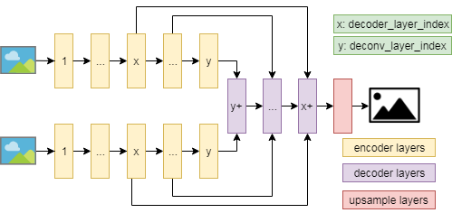

# motionseg

## dataset
- cdnet dataset
- fbms dataset

## model
- motion_fcn
- motion_unet

## flownet
- https://github.com/NVIDIA/flownet2-pytorch
- https://github.com/sniklaus/pytorch-liteflownet