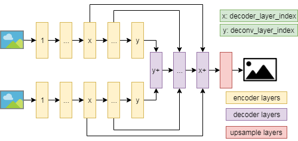

# motionseg

## dataset
- cdnet dataset
- fbms/fbms-3d dataset

## model
- motion_fcn
- motion_unet


## flownet
- https://github.com/NVIDIA/flownet2-pytorch
- https://github.com/sniklaus/pytorch-liteflownet

## train
```
python test/fbms_train.py --net_name motion_attention --batch_size 4 --epoch 50 --upsample_layer 2 --freeze_layer 1 --deconv_layer 5 --dataset FBMS --backbone_name vgg16_bn --note zzl --save_model True --app train
```

## test
```
# save output image
python models/motionseg/motion_benchmark.py benchmark xxx/xxx.txt
# generate showcase
python models/motionseg/motion_benchmark.py showcase xxx/xxx.txt
# obtain benchmark table
python models/motionseg.py evaluation xxx/xxx.txt
```

## zzl noise test
```
modify utils/augmentor.py --> ImageAugmenter --> __init__ and augument_image
modify dataset/segtrackv2_dataset.py --> motionseg_dataset --> __init__ and __getitem__
```

## cdnet2014 
background 0
shadow 50
out of roi 85
unknown 170
foreground 255
```
def convert_label(img):
    labels=np.zeros_like(img)
    labels[img==85]=255
    labels[img==170]=255
    labels[img==255]=1
    labels=labels.astype(np.uint8)
    return labels
```